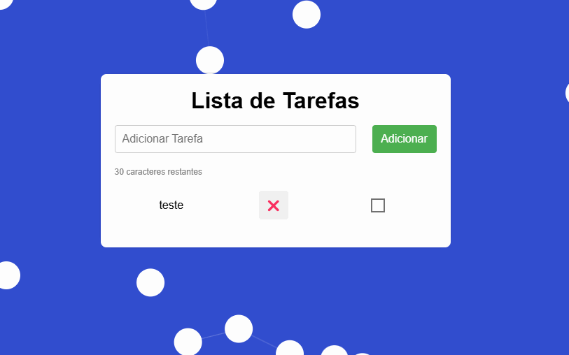

📝 To Do List – Lista de Tarefas
Aplicativo de lista de tarefas feito com HTML, CSS e JavaScript puro, com suporte a animações suaves e armazenamento local via localStorage. Ideal para organizar tarefas do dia a dia de forma simples, leve e responsiva.

🚀 Funcionalidades
✅ Adicionar e remover tarefas

✏️ Marcar tarefas como concluídas

💾 Salvamento automático no navegador (localStorage)

🎨 Animações com CSS para uma experiência fluida

📱 Layout responsivo (funciona bem no mobile e desktop)

🌙 Modo escuro (opcional, se você tiver incluído)

🛠 Tecnologias utilizadas
HTML5

CSS3 (com transições e animações)

JavaScript (Vanilla)

localStorage para persistência de dados

📷 Preview

